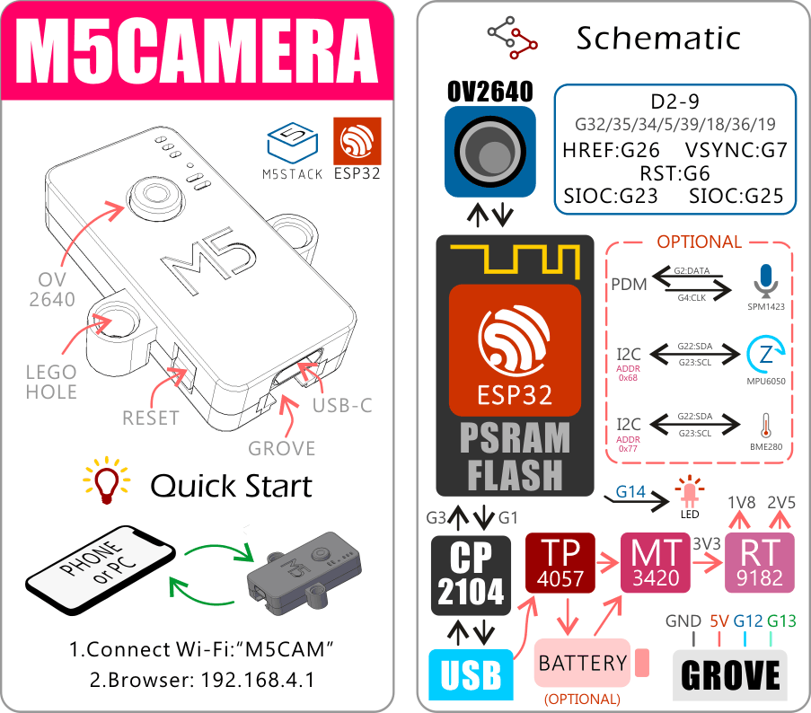
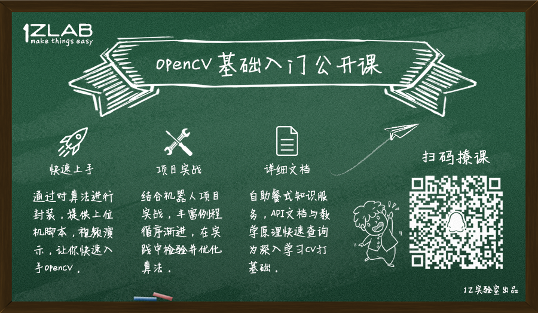

# ESP-CAM使用教程

作者: 阿凯 (QQ 244561792)

**1Z实验室(1zlab)出品 : make things easy**

## ESP-CAM 简介

ESP-CAM采用**ESP32**作为主控, 感光芯片为**OV2640**. 可以实现**WIFI传图**的功能. [Github开源项目地址](https://github.com/igrr/esp32-cam-demo) 
ESP-CAM开启热点, 电脑连接ESP-CAM的热点, 然后在浏览器中输入对应的URL就可以获取到摄像头拍摄的画面/视频流.

ESP-CAM(M5CAMERA)的生产商为M5Stack, 他们在原有的开源项目基础上对硬件进行了改进, 感谢M5Stack所做的贡献. 


## 文档

阿凯编写了相关的文档教程, 方便大家使用ESP-CAM.

* [ESP-CAM的简易使用教程-1Z实验室](./文档/ESP-CAM的简易使用.md)
* [Ubuntu下ESP-CAM固件烧录指南-1Z实验室](./文档/Ubuntu下ESP-CAM固件烧录指南.md)
* [Ubuntu下ESP-IDF 开发环境配置-1Z实验室](./文档/Ubuntu下ESP-IDF开发环境配置.md)
* [修改并编译ESP-CAM的源码](./文档/修改并编译ESP-CAM的源码.md)

## 固件

固件文件见 `./固件` 

```
bootloader.bin
esp32-cam-demo.bin
flash.sh
partitions_singleapp.bin
```

使用教程见: [Ubuntu下ESP-CAM固件烧录指南-1Z实验室](./文档/Ubuntu下ESP-CAM固件烧录指南-1Z实验室.md)


## 硬件资料

硬件资料包括M5Stack出品的ESP-CAM的硬件原理图, ESP32与OV2640的数据手册.

见文件夹 `./硬件资料`

```
├── 数据手册
│   ├── esp32_datasheet_cn.pdf
│   └── OV2640DS.pdf
└── 原理图
    └── M5CAM-ESP32-A1-POWER.pdf
```


## 源代码

**工程结构介绍**

`main/app_main.c` 这里是整个工程的主函数, 这里你可以设定像素格式, 分辨率等. 也可以自行修改功能.

`camera`下存放的是跟摄像头相关的代码, 主要是感光芯片采集图像部分. 

`http_server` 是esp32作为服务器,进行http通信所依赖的库.

```
├── components
│   ├── camera
│   │   ├── bitmap.c
│   │   ├── camera.c
│   │   ├── camera_common.h
│   │   ├── component.mk
│   │   ├── include
│   │   │   ├── bitmap.h
│   │   │   └── camera.h
│   │   ├── Kconfig
│   │   ├── ov2640.c
│   │   ├── ov2640.h
│   │   ├── ov2640_regs.h
│   │   ├── ov7725.c
│   │   ├── ov7725.h
│   │   ├── ov7725_regs.h
│   │   ├── sccb.c
│   │   ├── sccb.h
│   │   ├── sensor.h
│   │   ├── twi.c
│   │   ├── twi.h
│   │   ├── wiring.c
│   │   ├── wiring.h
│   │   ├── xclk.c
│   │   └── xclk.h
│   └── http_server
│       ├── component.mk
│       ├── http_server.c
│       ├── http_server.h
│       ├── LICENSE
│       └── README.md
├── LICENSE
├── main
│   ├── app_main.c
│   ├── component.mk
│   └── Kconfig.projbuild


```

## 1Z实验室(1zlab)
