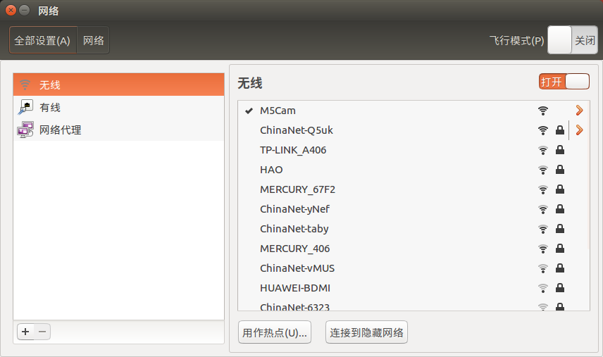
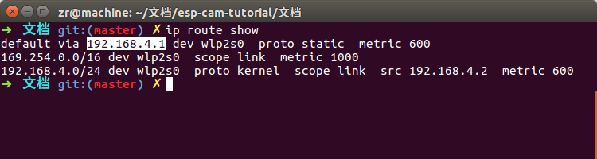
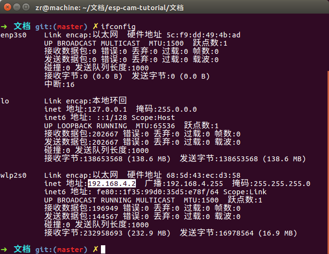
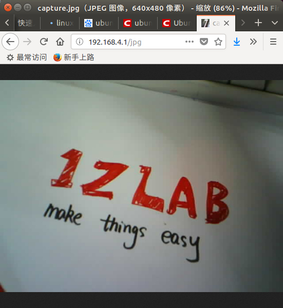
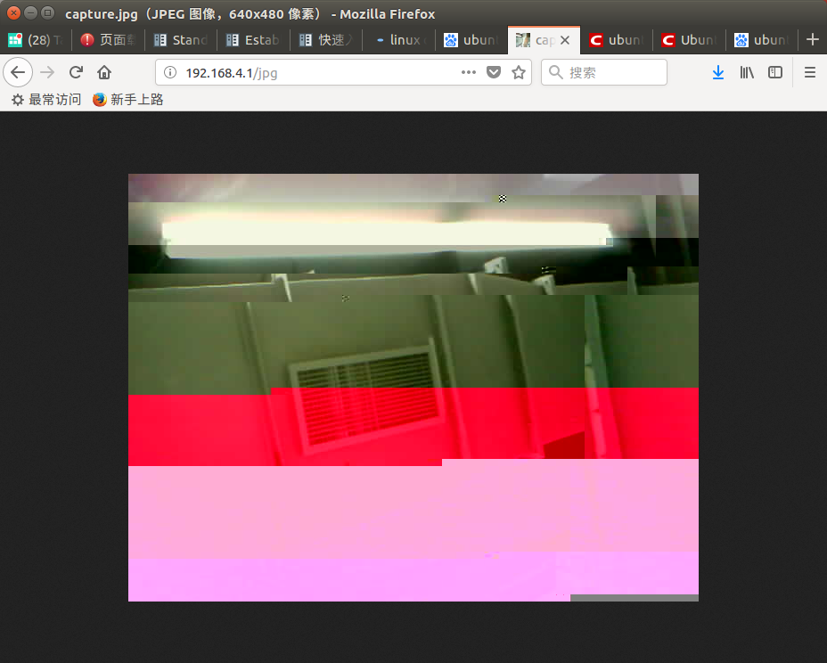

# ESP-CAM的简易使用指南-1Z实验室

作者: 阿凯 (QQ 244561792)
1Z实验室(1zlab)出品 : make things easy


## 概要

在ESP-CAM的固件上面, 默认执行的程序为`WIFI传图`. 
ESP-CAM开启热点, 电脑连接ESP-CAM的热点, 然后在浏览器中输入对应的URL就可以获取到摄像头拍摄的画面/视频流.

## 目录

使用ESP-CAM 仅需要如下几步

[1ESP-CAM初始化](#1ESP-CAM初始化)

[2连接WIFI](#2连接WIFI)

[3查看IP地址](#3查看IP地址)

[4浏览图片/视频流](#4浏览图片/视频流)

[5问题与解决方案](#5问题与解决方案)


## 1ESP-CAM初始化

首先ESP-CAM需要通过TypeC接口供电, 红色指示灯会亮.

然后上电运行代码, 你也可以使用侧面的复位按键`RST`,重新初始化.  


## 2连接WIFI
在**电脑/手机**上面连接热点**M5Cam**, 没有密码, 直接连上. 

> 当然, 如果你会修改固件的话, 也可以修改为其他名字.




**注意: ESP-CAM一次只允许连接一个设备.**


## 3查看IP地址

> 备注: 这部分其实不是很必要, 但是可以让你多学一点知识. 
>
> ESP-CAM的默认IP就是**192.168.4.1** , 这个不会变. 如果你的操作系统不是Ubuntu可以跳过此部分. 


所谓`网关(Gateway)`其实本质上就是**ESP-CAM的IP地址**.
如果你使用的是Ubuntu操作系统, 你可以通过如下命令行查看网关:
```bash
ip route show
```



可以看到当前的ESP-CAM对应的IP地址是**192.168.4.1**. 

执行下面的语句

```
ifconfig
```

我们可以看到, 当前PC分配到的IP地址为**192.168.4.2**




## 4浏览图片/视频流

打开浏览器, 直接输入**192.168.4.1** 会显示视频流, 画面会实时刷新.





## 5问题与解决方案

声明: 这里所描述的问题, 是我在使用ESP-CAM的过程中踩的坑. 

**ESP-CAM是一个比较有创意的产品,但是一开始可能会存在一些不稳定, 存在一些硬件缺陷, 希望我们可以用比较包容的心态看待这些问题, 一起让它变得更好.**


### 问题1: Firefox下面访问视频流刷新慢, 部分图像缺失

解决方案: 试一下在Chrome浏览器下访问, 就会好很多. 

暂时不知道底层原因.

效果视频见: `./VIDEO/问题1-演示视频.mkv`


### 问题2: 画面怪异



这个是由于ESP-CAM散热问题导致的, 因为我买的是旧版没带散热片, 所以温度过高,导致感光芯片工作异常. 

效果视频见: `./VIDEO/问题2-演示视频.mkv`

解决方案: 

1. 拆掉外壳,  添加散热片.
2. 带她(ESP-CAM)吹一下空调.
