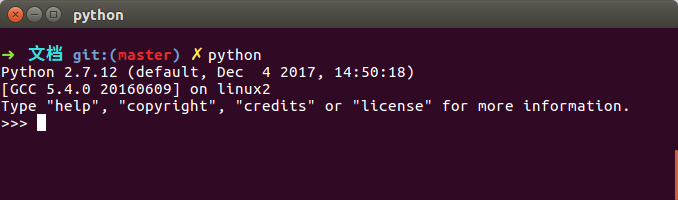

# Ubuntu下ESP-CAM固件烧录指南-1Z实验室

作者: 阿凯 (QQ 244561792)

**1Z实验室(1zlab)出品 : make things easy**


## 概要

 本教程以ESP-CAM为例讲解了如何在Ubuntu下给ESP32开发板烧录固件.


## 目录

[1查看ESP32开发板的串口号](#1查看ESP32开发板的串口号)

[2设备权限问题](#2设备权限问题)

[3安装ESP32固件烧录工具](#3安装ESP32固件烧录工具)

[4烧录固件](#4烧录固件)

## 1查看ESP32开发板的串口号

**首先, 将你的ESP32开发板与电脑串口相连接. **

一般来讲ESP32的设备串口设备编号会从`/dev/ttyUSB0`开始, 如果你电脑上插了多个设备,也可能是`/dev/ttyUSB1`等等. 

你可以通过下面的指令查看设备列表:

```bash
ls -l /dev/ttyUSB*
```

样例输出: 

```
crw-rw---- 1 root dialout 188, 0 7月  19 10:35 /dev/ttyUSB0
```


## 2设备权限问题

在Ubuntu下面, 如果你想连上esp32的开发版的时候, 刚开始的时候会提示你没有权限. 

需要将当前的系统用户添加到`dialout`用户组中. 执行下面的命令行:  

```bash
sudo usermod -a -G dialout $USER
```

**因为默认Ubuntu中的普通用户是无权访问串口设备的, 因tty设备隶属于dialout用户组，所以将用户添加至dialout用户组，该用户就会具备访问tty等串口设备的权限. **


## 3安装ESP32固件烧录工具

给ESP32开发板烧录需要用到特定的烧录工具称之为**ESPTool**

**注意: ESPTool是基于python2.7的, 只能通过pip2进行安装.**

检验一下默认的python是不是python2.7.




如果`pip`没有安装的话, 需要先安装`pip`:

```bash
sudo apt-get install python-pip
```

```bash
sudo pip install esptool --upgrade
```

> **备注**
>
> 如果是anaconda  , 就不能直接通过`pip` 安装。
>
> 可以在`.bashrc`中， 先注释掉anaconda的Path ,然后`source ~/.bashrc` 
>
> 这样python就变为了默认的python2.7


## 4烧录固件

接下来进入固件文件夹. 

```bash
cd <文件夹路径>/esp-cam-tutorial/固件/m5cam-firmware
```

在步骤1里面你已经获取到了ESP-CAM的设备号 `/dev/ttyUSB0` 或者其他.

替换下方的设备编号, 执行下方的脚本.

```bash
sudo esptool.py --chip esp32 --port /dev/ttyUSB0 --baud 921600 --before default_reset --after hard_reset write_flash -z --flash_mode dio --flash_freq 40m --flash_size detect 0x1000 bootloader.bin 0x10000 esp32-cam-demo.bin 0x8000 partitions_singleapp.bin
```

这样语句规定了芯片类型`--chip`, 端口号`--port` , 波特率`--baud` 还有一些分区方面的细节(暂时不必深究). 

**烧录日志**

```
esptool.py v2.4.1
Serial port /dev/ttyUSB0
Connecting....
Chip is ESP32D0WDQ6 (revision 1)
Features: WiFi, BT, Dual Core, 240MHz, VRef calibration in efuse
MAC: 80:7d:3a:c4:85:90
Uploading stub...
Running stub...
Stub running...
Changing baud rate to 921600
Changed.
Configuring flash size...
Auto-detected Flash size: 4MB
Flash params set to 0x0220
Compressed 20944 bytes to 12340...
Wrote 20944 bytes (12340 compressed) at 0x00001000 in 0.2 seconds (effective 1022.5 kbit/s)...
Hash of data verified.
Compressed 601712 bytes to 367464...
Wrote 601712 bytes (367464 compressed) at 0x00010000 in 5.6 seconds (effective 866.6 kbit/s)...
Hash of data verified.
Compressed 3072 bytes to 103...
Wrote 3072 bytes (103 compressed) at 0x00008000 in 0.0 seconds (effective 9866.9 kbit/s)...
Hash of data verified.

Leaving...
Hard resetting via RTS pin...

```


接下来,按一下`ESP-CAM`侧方的复位`RST`按键, 预设代码开始运行. 


