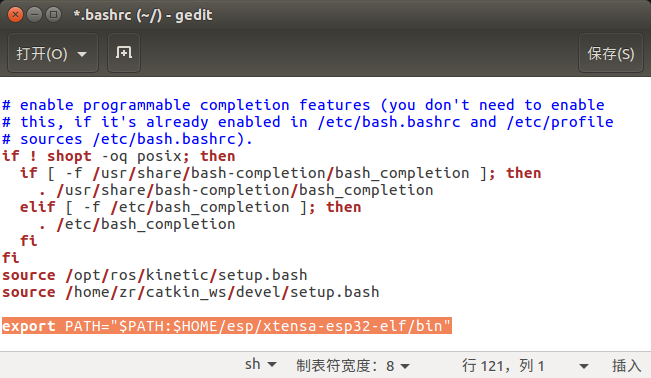

# Ubuntu下配置ESP-IDF的开发环境-1Z实验室

作者: 阿凯 (QQ 244561792)
**1Z实验室(1zlab)出品 : make things easy**


## 官方文档

Ubuntu下配置ESP-IDF的开发环境配置以乐鑫的官方文档(英文)为准. 

[英文文档: Standard Setup of Toolchain for Linux](https://esp-idf.readthedocs.io/en/latest/get-started/linux-setup.html)

[中文文档: Linux 平台工具链的标准设置](https://esp-idf.readthedocs.io/zh_CN/latest/get-started/linux-setup.html)

本教程仅涉及Ubuntu下配置ESP-IDF的开发环境教程. 

建议搭配此教程与中文文档一起看. 

## 目录
* [1安装依赖包](#1安装依赖包)
* [2配置工具链](#2配置工具链)
* [3查看ESP32开发板的串口号](#3查看ESP32开发板的串口号)
* [4设备权限问题](#4设备权限问题)
* [5安装ESP32的库](#5安装ESP32的库)
* [6设置ESP-IDF的系统环境变量](#6设置ESP-IDF的系统环境变量)


## 1安装依赖包

安装ESP-IDF编译所需要的工具包.

```bash
sudo apt-get install gcc git wget make libncurses-dev flex bison gperf python python-serial
```


## 2配置工具链

在用户主目录下创建一个文件夹叫`esp` . 

>  注释: `-p` 代表递归方式创建 `~`是当前用户根目录的表示符.

```bash
 mkdir -p ~/esp
```

并且进入到该文件夹下.

```
cd ~/esp
```

下载工具链压缩包, 看你电脑是64位还是32位, 下载对应的压缩包. 

- [64-bit Linux下载链接](https://dl.espressif.com/dl/xtensa-esp32-elf-linux64-1.22.0-80-g6c4433a-5.2.0.tar.gz)

  https://dl.espressif.com/dl/xtensa-esp32-elf-linux64-1.22.0-80-g6c4433a-5.2.0.tar.gz

- [32-bit Linux下载链接](https://dl.espressif.com/dl/xtensa-esp32-elf-linux32-1.22.0-80-g6c4433a-5.2.0.tar.gz)

  https://dl.espressif.com/dl/xtensa-esp32-elf-linux32-1.22.0-80-g6c4433a-5.2.0.tar.gz


使用`wget`下载压缩包. (**这里我下载的是64位的.** )
```bash
wget https://dl.espressif.com/dl/xtensa-esp32-elf-linux64-1.22.0-80-g6c4433a-5.2.0.tar.gz
```


下载完成之后,解压此压缩文件. 当前文件夹下面就出现了一个叫做`xtensa-esp32-elf`的文件夹.

```bash
➜  esp ls
xtensa-esp32-elf  xtensa-esp32-elf-linux64-1.22.0-80-g6c4433a-5.2.0.tar.gz
```


接下来我们需要把`xtensa-esp32-elf/bin`这个路径添加到系统路径`PATH`里面, 需要修改`.bashrc`. 

编辑文件`.bashrc`

```bash
gedit ~/.bashrc
```

在`.bashrc`文件末尾追加一行:

```bash
export PATH="$PATH:$HOME/esp/xtensa-esp32-elf/bin"
```

如下图所示:



接下来, 更新系统环境变量. 

```
source ~/.bashrc
```

> 友情提示, 如果你当前使用的fish,或者zsh等等这些工具话, 麻烦先切换到`bash`. 
>
> 如果你不知道fish或者zsh是啥的话, forget it , 你不会遇到这种问题.


## 3查看ESP32开发板的串口号

**首先, 将你的ESP32开发板与电脑串口相连接. **

一般来讲ESP32的设备串口设备编号会从`/dev/ttyUSB0`开始, 如果你电脑上插了多个设备,也可能是`/dev/ttyUSB1`等等. 

你可以通过下面的指令查看设备列表:

```bash
ls -l /dev/ttyUSB*
```
样例输出: 
```
crw-rw---- 1 root dialout 188, 0 7月  19 10:35 /dev/ttyUSB0
```


## 4设备权限问题

在Ubuntu下面, 如果你想连上esp32的开发版的时候, 刚开始的时候会提示你没有权限. 

需要将当前的系统用户添加到`dialout`用户组中. 执行下面的命令行:  

```bash
sudo usermod -a -G dialout $USER
```

**因为默认Ubuntu中的普通用户是无权访问串口设备的, 因tty设备隶属于dialout用户组，所以将用户添加至dialout用户组，该用户就会具备访问tty等串口设备的权限. **


## 5安装ESP32的库

工具链（包括用于编译和构建应用程序的程序）安装完后，你还需要 ESP32 相关的 API/库。API/库在 [ESP-IDF 仓库](https://github.com/espressif/esp-idf) 中。要获取这些 API/库，打开一个终端，进入某个你希望存放 ESP-IDF 的目录，然后 `git clone` 以下指令：

```bash
cd ~/esp
git clone --recursive https://github.com/espressif/esp-idf.git
```

> 备注: 因为原来的代码仓库可能有引用其他工程, 所以我们需要用递归`--recursive` 的方式将依赖的仓库也克隆(clone)下来. **注意不要漏掉--recursive**

如果你clone的时候,忘记使用`--recursive` 运行下面的命令行:

```bash
cd ~/esp/esp-idf
git submodule update --init
```


`esp-idf` 就会被下载到`~/esp/esp-idf`文件夹下.

> TODO esp-idf一直下载不下来.

## 6设置ESP-IDF的系统环境变量

> 步骤类似上文给toolchain添加系统环境变量.

打开`~/.bashrc`

```bash
gedit ~/.bashrc
```

在`.bashrc`文件末尾追加一行:

```bash
export IDF_PATH=~/esp/esp-idf
```

保存并关闭文件.执行下面的语句:

```bash
source ~/.bashrc
```

检验一下, 在终端输入: 

```bash
echo $IDF_PATH
```

如果得到类似这样的输出:

```
/home/zr/esp/esp-idf
```

就说明系统环境变量配置成功.


## 7结尾

这样我们的开发环境其实就配置好了.

接下来你需要学习的是**如何创建工程并烧录到ESP32开发板上面.**

[官方文档-创建一个工程](https://esp-idf.readthedocs.io/zh_CN/latest/get-started/index.html#get-started-start-project)

> 因为ESP-IDF官方写的已经足够详细了, 所以在这里,不必赘述, 大家看文档就好了.

如何编译ESP-CAM源码的教程,我这里还是赘述了一下, 见文档[编译ESP-CAM的源码](./编译ESP-CAM的源码.md).