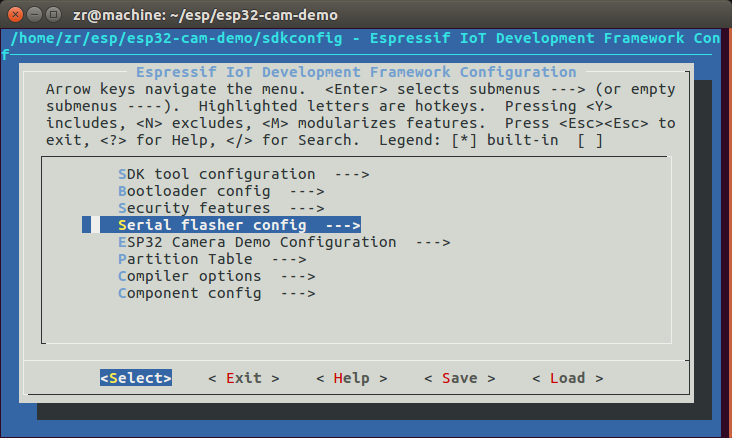
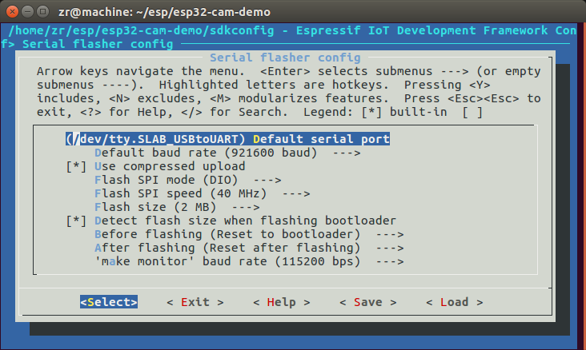

# 修改并编译ESP-CAM的源码-1Z实验室

作者: 阿凯 (QQ 244561792)
**1Z实验室(1zlab)出品 : make things easy**

## 目录

[1编译配置](#1编译配置)
[2修改ESP32的源码](#2修改ESP32的源码)
[3编译并烧录固件](#3编译并烧录固件)

## 1编译配置

直接进入ESP-CAM源码的文件夹下:

```
$ pwd
/home/{USER_NAME}/esp/esp32-cam-demo
```

这里我是把源码文件夹`esp32-cam-demo` 复制到了`~/esp`文件夹下.


执行下面的指令:

```bash
make menuconfig
```

从而完成相关的配置. 举例来讲我们设置ESP32开发板的编号, 就需要:

1. 方向键盘`上下` 选择`Serial flasher config`
2. 方向键盘`左右` 选择`Select`



选择`/dev/tty.SLAB_USBtoUART` 默认串口端口. 选择`Select`. 

接下来, 依次`Save`保存配置, 然后退出`Exit`



## 2修改ESP32的源码

**这一步是可选项, 如果没有修改固件的需求, 可以直接跳到下一步.**

主要要修改的其实就是`main/app_main.c`.
我想了一下, 可能最常用的修改是修改分辨率吧, 分辨率影响帧率.
```c
// 设置相机的尺寸 分辨率:  800x600 (见 camera.h camera_framesize_t)
// 可以自行修改分辨率.
#define CAMERA_FRAME_SIZE CAMERA_FS_SVGA
```
只要修改`CAMERA_FRAME_SIZE`的宏定义就可以修改相机拍摄画面的分辨率. 
有效的`CAMERA_FRAME_SIZE`取值,在`components/camera/include/camera.h`里有定义.

```c
// 分辨率设定
typedef enum {
    CAMERA_FS_QQVGA = 4,     //!< 160x120
    CAMERA_FS_QVGA = 8,      //!< 320x240
    CAMERA_FS_VGA = 10,      //!< 640x480
    CAMERA_FS_SVGA = 11,     //!< 800x600
} camera_framesize_t;

```

另外一个可以修改的地方是`jpg`格式图片的质量`quality`.
质量越低, 压缩程度越大. 

```c
// 设定jpg图像的质量
camera_config.jpeg_quality = 15;
```

## 3编译并烧录固件

编译源代码, 并将固件烧录到ESP32的开发板上面.

```bash
make flash
```

完成固件烧录.

在这个过程中,可能还要下载一些项目所依赖的库, 需要耐心等待.

完成之后你就可以按照[ESP-CAM的简易使用](./ESP-CAM的简易使用.md) 里面的说明测试ESP-CAM模块了.